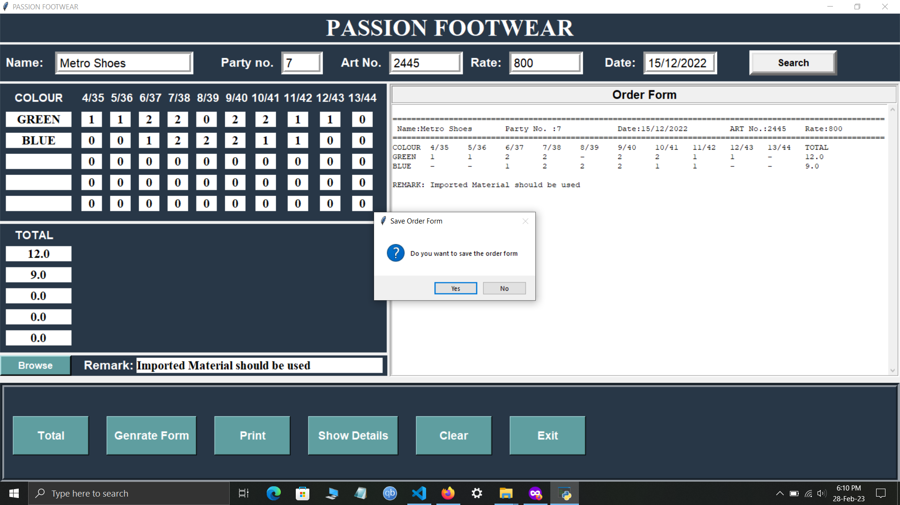

# Footwear Order Form
A footwear order form GUI application is a software program that allows users to generate an order form for their clients and submit it to their manufacturer for the production of footwear, using a user-friendly graphical user interface (GUI). Users can select from a variety of different footwear article numbers, sizes, colors, and materials, and add them to the form to then print it. The goal of the application is to provide an easy and convenient way for users to generate an order form for their manufacturer.

*I am currently working on adding image functionality to the project, which will include displaying the image and enabling users to save it. This feature is in progress and will be available soon.*
